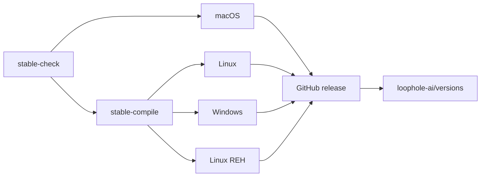

# Loophole Builder Pipeline Scripts

The builder keeps CI entry points at the repository root and shared functions under `scripts/`.

## Directory layout

```text
.
├── ci_repo.sh                 # Clone the IDE source or check out a builder PR
├── ci_check.sh                # Select version, release policy, and build flags
├── ci_platform.sh             # Install GitHub CLI and configure platform builds
├── prepare_vscode.sh          # Generate assets, apply patches, and configure product metadata
├── build.sh                   # Compile editor and remote-server sources
├── prepare_assets.sh          # Build platform artifacts and checksums
├── release.sh                 # Create/update the GitHub release
├── update_version.sh          # Update the static versions repository
├── icons/build_icons.sh       # Generate Loophole icons in the IDE source tree
├── scripts/
│   ├── lib/utils.sh           # Shared variables and patch helpers
│   ├── lib/ci_lib.sh          # Version, release, GitHub CLI, and build-flag helpers
│   ├── build_cli.sh           # Build and install the Rust CLI/tunnel binary
│   ├── update_settings.sh     # Disable telemetry-related defaults
│   ├── undo_telemetry.sh      # Block Microsoft telemetry endpoints
│   ├── prepare_src.sh         # Create source archives
│   └── update_upstream.sh     # Maintain upstream source metadata
├── build/                     # OS-specific packaging scripts
├── patches/                   # IDE and packaging patches
└── stores/                    # Optional Snap and WinGet metadata
```

## CI flow



The `stable.yml` workflow is the only top-level orchestrator. Reusable `workflow_call` files perform the individual jobs so source compilation is not duplicated by several independent triggers.

## Key environment variables

| Variable | Purpose |
|---|---|
| `APP_NAME` | Product name used in artifacts; defaults to `Loophole` |
| `BINARY_NAME` | Binary identifier; defaults to `loophole` |
| `GH_REPO_PATH` | IDE repository; defaults to `loophole-ai/loophole-ide` |
| `ASSETS_REPOSITORY` | Repository that receives release assets |
| `VERSIONS_REPOSITORY` | Static update-feed repository; defaults to `loophole-ai/versions` |
| `LOOPHOLE_BUILDER_ROOT` | Absolute builder root, initialized by `scripts/lib/utils.sh` |
| `LOOPHOLE_VERSION` | Loophole product version such as `2.2.3` |
| `MS_TAG` | Underlying VS Code base version such as `1.121.0` |
| `RELEASE_VERSION` | GitHub release tag; normally equal to `LOOPHOLE_VERSION` |
| `BUILD_SOURCEVERSION` | IDE source commit used to identify the build |
| `SHOULD_BUILD` | Run the compilation job |
| `SHOULD_DEPLOY` | Publish release assets and update metadata |

## Platform scripts

| Script | Purpose |
|---|---|
| `build/linux/package_bin.sh` | Package the Linux desktop application from the compiled artifact |
| `build/linux/package_reh.sh` | Package the Linux remote extension host |
| `build/windows/package.sh` | Package the Windows desktop application |
| `build/linux/appimage/build.sh` | Build the optional AppImage |
| `build/windows/msi/build.sh` | Build the English Windows MSI package |

## Local development

`dev/build.sh` is a convenience wrapper around source checkout, compilation, and asset generation. Its supported flags are `-i`, `-o`, `-p`, and `-s`.
